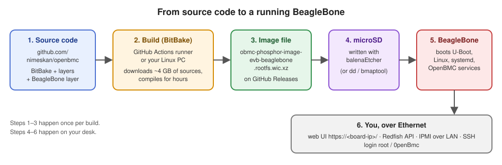
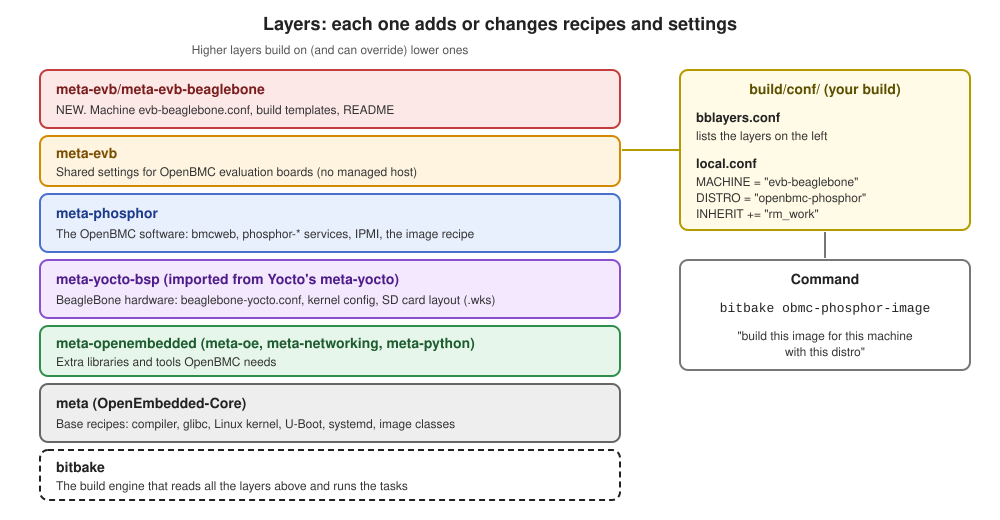
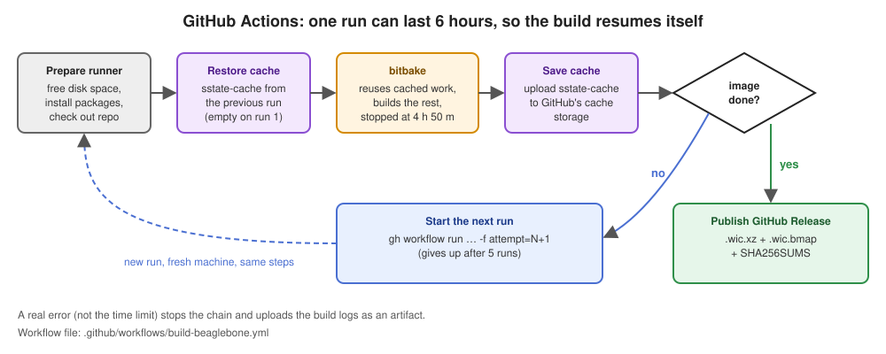
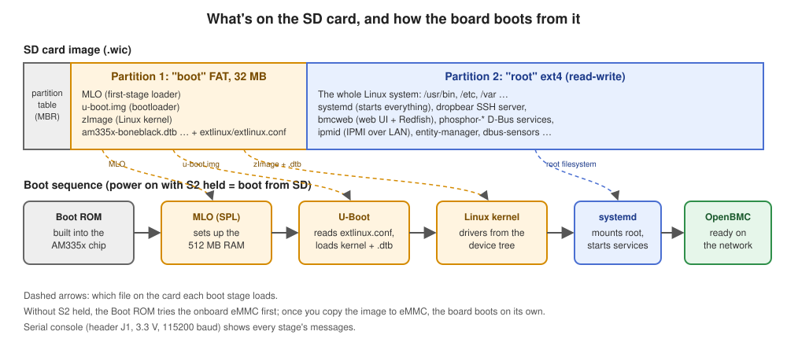

# OpenBMC on the BeagleBone Black: the complete guide

This folder explains, step by step, how this repository turns source code
into an OpenBMC firmware image for the
[BeagleBone Black](https://www.beagleboard.org/boards/beaglebone-black), and
how you can do the same build yourself.

It's written for someone new to Linux, Yocto and OpenBMC. Every term is
explained the first time it appears, and every command is shown.

| File | What it is |
| --- | --- |
| [`README.md`](README.md) | This guide |
| [`build-beaglebone.sh`](build-beaglebone.sh) | Script that sets up a Linux PC and builds the image locally |
| [`images/`](images/) | Diagrams used in this guide |
| [`connecting-from-a-windows-pc.md`](connecting-from-a-windows-pc.md) | Reaching the board from a Windows PC: serial terminal, direct Ethernet cable (no network), web UI, Redfish, SSH |
| [`redfish-i2c-sensor/`](redfish-i2c-sensor/README.md) | Follow-up guide: Redfish explained, and adding an I2C sensor all the way to the web UI |

Other files this guide talks about, elsewhere in the repository:

| Path | What it is |
| --- | --- |
| [`meta-evb/meta-evb-beaglebone/`](../meta-evb/meta-evb-beaglebone/) | The BeagleBone layer (the board's build configuration) |
| [`upstream-layers/meta-yocto/`](../upstream-layers/meta-yocto/) | Yocto's BeagleBone hardware support, copied in |
| [`.github/workflows/build-beaglebone.yml`](../.github/workflows/build-beaglebone.yml) | The GitHub Actions workflow that builds the image in the cloud |

---

## Contents

1. [The short version](#1-the-short-version)
2. [Background: the words you need](#2-background-the-words-you-need)
3. [The big picture](#3-the-big-picture)
4. [What was done, step by step](#4-what-was-done-step-by-step)
5. [The BeagleBone layer, file by file](#5-the-beaglebone-layer-file-by-file)
6. [How a BitBake build works](#6-how-a-bitbake-build-works)
7. [The cloud build (GitHub Actions)](#7-the-cloud-build-github-actions)
8. [What's in the finished image](#8-whats-in-the-finished-image)
9. [Flash and boot](#9-flash-and-boot)
10. [Using your BMC](#10-using-your-bmc)
11. [Building on your own Linux PC](#11-building-on-your-own-linux-pc)
12. [Troubleshooting](#12-troubleshooting)
13. [Adding more boards later](#13-adding-more-boards-later)
14. [Reference: versions, tools and links](#14-reference-versions-tools-and-links)

---

## 1. The short version

* **Get the image:** open this repository's
  [Releases page](https://github.com/nimeskan/openbmc/releases) and download
  `obmc-phosphor-image-evb-beaglebone.wic.xz`. The first release is
  [`beaglebone-20261004-0244`](https://github.com/nimeskan/openbmc/releases/tag/beaglebone-20261004-0244)
  (39.6 MB download, 174 MB once written to the card).
* **Write it to a microSD card** with [balenaEtcher](https://etcher.balena.io/).
* **Boot:** put the card in the BeagleBone, hold the **S2** button, and plug
  in power. Plug in an Ethernet cable.
* **Log in:** open `https://<board-ip>/` in a browser. The user is `root` and
  the password is `0penBmc` (that's a zero, not the letter O).
* **Build it yourself instead:** on an Ubuntu 24.04 PC with 60+ GB free, run
  `beaglebone/build-beaglebone.sh`.

---

## 2. Background: the words you need

**BMC (Baseboard Management Controller).** A small computer that lives on a
server's motherboard, separate from the server's main CPU. It lets
administrators power the server on and off, read temperatures and fan
speeds, and watch the console, all over the network, even when the main
server is off or crashed.

**OpenBMC.** An open-source firmware (software) project for BMCs, started by
Facebook, IBM, Google, Intel and Microsoft and now run by the Linux
Foundation. It's a small Linux system with a set of services that do the
management work. Website: <https://www.openbmc.org/>, code:
<https://github.com/openbmc/openbmc>, docs: <https://github.com/openbmc/docs>.

**BeagleBone Black.** A credit-card-sized single-board computer with a TI
AM335x ARM Cortex-A8 CPU (1 GHz), 512 MB of RAM, 4 GB of onboard eMMC
storage, a microSD slot, Ethernet, and lots of GPIO, I2C and SPI pins.
Real BMCs use special chips (ASPEED AST2600, Nuvoton NPCM8xx); the BeagleBone
isn't one, but it can run the same software. See
[what works and what doesn't](#what-works-and-what-doesnt).

**Embedded Linux.** Linux built for one specific device, containing only
what that device needs. You don't install it from a USB stick like a desktop
Linux; you *build* it on a bigger computer and copy the result onto the
device.

**Cross-compiling.** Building programs on one kind of computer (your x86 PC)
that run on another kind (the BeagleBone's ARM CPU). It needs a special
compiler, called a cross-compiler.

**The Yocto Project.** A set of tools for building custom embedded Linux
systems from source code. OpenBMC uses it. Website:
<https://www.yoctoproject.org/>, docs: <https://docs.yoctoproject.org/>.

**OpenEmbedded (OE) and OpenEmbedded-Core (oe-core).** The build system at
the heart of Yocto, and its core set of recipes. In this repository,
oe-core is in `upstream-layers/openembedded-core/` and shows up as `meta/`.

**BitBake.** The build engine. You give it a target (`bitbake
obmc-phosphor-image`) and it works out everything that target needs, then
downloads, compiles and packages it all in the right order, running many
tasks at once. In this repository it's in `upstream-layers/bitbake/`.

**Recipe (`.bb` file).** Instructions for building one piece of software:
where to download it, which patches to apply, how to configure, compile and
install it. Example: `bmcweb_git.bb` builds OpenBMC's web server.

**Append file (`.bbappend`).** Changes to an existing recipe from another
layer, without editing the original.

**Layer (`meta-*` directory).** A folder of recipes and configuration on one
topic, such as "OpenBMC software", "BeagleBone hardware" or "extra Python
libraries". A build stacks several layers; higher ones can override lower
ones. Layer index: <https://layers.openembedded.org/>.

**Machine.** Which board you're building for, set by a `.conf` file in a
layer's `conf/machine/` folder. Ours is `evb-beaglebone`. The machine decides
the CPU type, kernel, bootloader and image format.

**Distro.** The policy for the whole system: which init system, which
features, default settings. OpenBMC's distro is `openbmc-phosphor`.

**Image.** A recipe that lists what goes into the final root filesystem.
OpenBMC's standard image is `obmc-phosphor-image`.

**Root filesystem (rootfs).** All the files of the running system: `/usr`,
`/etc`, `/var` and so on.

**Bootloader (U-Boot).** The small program that runs first when the board
powers on. It starts the Linux kernel. Website:
<https://docs.u-boot.org/>.

**Device tree (`.dtb` file).** A description of a board's hardware (which
chips sit at which addresses, which pins do what) that the Linux kernel reads
at boot. The BeagleBone Black's is `am335x-boneblack.dtb`.

**wic.** Yocto's tool for building a complete, partitioned disk image (an
exact copy of an SD card). A `.wks` file (kickstart) describes the
partitions. The output is a `.wic` file; `.wic.xz` is that file compressed.

**sstate cache (shared state).** BitBake saves the output of each finished
task in `sstate-cache/`. Next time, if nothing about that task changed, it
reuses the saved output instead of rebuilding. That's why a second build
takes minutes instead of hours.

**GitHub Actions.** GitHub's service for running scripts ("workflows") on
GitHub's own computers ("runners"). We use it because the build needs more
disk space than the cloud session that set this up had.

**D-Bus, systemd, Redfish, IPMI.** systemd starts and supervises all
services on the running BMC. The OpenBMC services talk to each other over
D-Bus (a message bus). You talk to the BMC over the network with Redfish
(a modern REST/JSON API, <https://www.dmtf.org/standards/redfish>) or IPMI
(an older binary protocol).

---

## 3. The big picture



1. **Source code.** This repository holds BitBake, all the layers, and our
   BeagleBone layer. Individual packages (the Linux kernel, bmcweb, ...)
   aren't in the repository; each recipe says where to download its own source.
2. **Build.** BitBake runs on a big x86 Linux machine: a GitHub Actions
   runner, or your own PC. It downloads about 4 GB of source code and
   compiles everything, including the cross-compiler itself.
3. **Image file.** The output is one compressed SD card image, about 40 MB.
4. **microSD card.** You write the image onto a card.
5. **BeagleBone.** It boots from the card.
6. **You** reach the BMC over the network.

### What works and what doesn't

A real BMC chip has hardware for talking to the server it manages: LPC/eSPI
buses, KCS interfaces, PECI for CPU temperatures, video capture for remote
screen (KVM). The BeagleBone has none of those, so those features have
nothing to talk to.

| Works on the BeagleBone | Doesn't work (no hardware for it) |
| --- | --- |
| Web interface (webui-vue) | Managing a real server's host CPU |
| Redfish REST API | KVM (remote screen) |
| IPMI over the network | In-band IPMI to a host (KCS/BT) |
| SSH login, users, logging, time sync | PECI CPU temperature readings |
| Sensors you wire to I2C (e.g. temperature chips), via hwmon | Host serial console redirection |
| GPIOs, LEDs, fans you add yourself | OpenBMC's A/B flash firmware update |

---

## 4. What was done, step by step

This is the full record of how this repository was set up, in order,
including the dead ends. Commands are shown as they were run. Where the
session ran as `root` inside a cloud container, the script for your PC
does the same thing as a normal user.

### Step 1: Look at the starting point

The GitHub repository `nimeskan/openbmc` had just been created and was
empty: no commits at all.

```sh
git log --oneline -1
# fatal: your current branch 'master' does not have any commits yet
```

### Step 2: Get the official OpenBMC source code

OpenBMC is developed at <https://github.com/openbmc/openbmc>. We added it as
a second "remote" (another place git can fetch from) called `upstream`, and
downloaded just the newest commit first (`--depth 1`) to save time:

```sh
git remote add upstream https://github.com/openbmc/openbmc.git
git fetch --depth 1 upstream master
git checkout -b master upstream/master
```

That gave upstream commit `56e79ce3` ("phosphor-bmc-code-mgmt: srcrev bump",
2 October 2026). The OpenBMC repository is a "monorepo": it already
contains, under `upstream-layers/`, copies of BitBake, OpenEmbedded-Core,
meta-openembedded, meta-arm, meta-raspberrypi and meta-security. The
top-level names like `meta` and `bitbake` are shortcuts (symbolic links) to
those folders.

### Step 3: Look for existing BeagleBone support

```sh
git ls-tree --name-only upstream/master meta-evb/
# meta-evb-arm  meta-evb-aspeed  meta-evb-nuvoton  meta-evb-raspberrypi
git ls-tree -r --name-only upstream/master | grep -i beaglebone
# only two meta-security files about dm-verity, no machine
```

Findings:

* OpenBMC has no BeagleBone machine.
* `meta-evb` holds "evaluation board" machines: dev boards that aren't real
  servers. The Raspberry Pi and Arm FVP ones were good examples to copy.
* Yocto itself supports the BeagleBone through a machine called
  `beaglebone-yocto`, in a layer called `meta-yocto-bsp` (BSP = Board
  Support Package). OpenBMC's monorepo **doesn't** include that layer.

We also learned how OpenBMC picks its image format, from
`meta-phosphor/conf/machine/include/obmc-bsp-common.inc`: real BMCs get a
raw SPI flash image (`mtd-static`), boards with eMMC get `wic`. Since the
BeagleBone boots from an SD card, we set `IMAGE_FSTYPES` to a `wic` image
directly and didn't include that file.

### Step 4: Bring in Yocto's BeagleBone support (meta-yocto-bsp)

OpenBMC's oe-core release series is called `blacksail` (the current
development series). The `master` branch of meta-yocto is compatible with it.

```sh
git ls-remote https://git.yoctoproject.org/meta-yocto | grep heads/master
git clone --depth 1 https://git.yoctoproject.org/meta-yocto
```

Only the `meta-yocto-bsp` folder was copied in, following the monorepo's
`upstream-layers/` pattern, with a shortcut at the top level:

```sh
mkdir -p upstream-layers/meta-yocto
cp -r meta-yocto/meta-yocto-bsp upstream-layers/meta-yocto/
cp meta-yocto/LICENSE upstream-layers/meta-yocto/
ln -s upstream-layers/meta-yocto/meta-yocto-bsp meta-yocto-bsp
```

Imported from meta-yocto commit
[`49a2b44583968d321b3195bfd0cb2232dff13950`](https://git.yoctoproject.org/meta-yocto/commit/?id=49a2b44583968d321b3195bfd0cb2232dff13950)
(30 September 2026), recorded in `upstream-layers/meta-yocto/IMPORT`.

What this layer gives us, in `conf/machine/beaglebone-yocto.conf`:

* CPU tuning for the Cortex-A8 (`tune-cortexa8.inc`).
* Linux kernel: `linux-yocto` 6.18, kernel image `zImage`, device trees
  `am335x-bone.dtb`, `am335x-boneblack.dtb`, `am335x-bonegreen.dtb`.
* U-Boot built with `am335x_evm_defconfig`, producing `MLO` and `u-boot.img`.
* The SD card layout `wic/beaglebone-yocto.wks` (see
  [section 8](#8-whats-in-the-finished-image)).

### Step 5: Write the BeagleBone layer

New folder `meta-evb/meta-evb-beaglebone/`, explained line by line in
[section 5](#5-the-beaglebone-layer-file-by-file). Then the first commit:

```
meta-evb: add BeagleBone Black (evb-beaglebone) machine
```

### Step 6: Install the build tools

BitBake needs a set of programs on the build computer ("host packages").
This is the official Yocto list for Ubuntu
([Yocto docs](https://docs.yoctoproject.org/ref-manual/system-requirements.html#ubuntu-and-debian)):

```sh
sudo apt-get update
sudo apt-get install -y build-essential chrpath cpio debianutils diffstat \
  file gawk gcc git iputils-ping libacl1 liblz4-tool locales python3 \
  python3-git python3-jinja2 python3-pexpect python3-subunit socat texinfo \
  unzip wget xz-utils zstd lz4
sudo locale-gen en_US.UTF-8
```

What each one is for is commented in
[`build-beaglebone.sh`](build-beaglebone.sh), step 2.

### Step 7: Create a normal user for building

BitBake refuses to run as `root`. The cloud session ran as root, so a
separate user `builder` was created and given ownership of the source tree:

```sh
useradd -m -s /bin/bash builder
chown -R builder:builder /home/user/openbmc
```

On your own PC you're already a normal user, so you skip this step.

### Step 8: Check the configuration loads

```sh
export TEMPLATECONF=meta-evb/meta-evb-beaglebone/conf/templates/default
. ./oe-init-build-env /home/builder/build
bitbake -e obmc-phosphor-image | grep -E '^(MACHINE|IMAGE_FSTYPES|WKS_FILE)='
```

Three problems came up here, in this order:

1. **`ModuleNotFoundError: No module named 'pysh'`.** BitBake generates a
   parser table file (`pyshtables.py`) the first time it runs. The first
   attempt ran before the ownership fix, couldn't write it next to BitBake,
   and left a stray copy in the build directory, which confused later runs.
   **Fix:** delete `/home/builder/build/pyshtables.py`. This won't happen on
   your PC, because there you own both folders from the start.
2. **`ERROR: No recipes in default available for: .../linux-yocto_7.2.bbappend`.**
   meta-yocto (newer) has a `.bbappend` for kernel 7.2, but OpenBMC's
   oe-core only has kernel 6.18. BitBake treats an append with no matching
   recipe as an error. **Fix:** delete that one file from the imported
   layer (recorded in `upstream-layers/meta-yocto/IMPORT`). The BeagleBone
   uses 6.18 anyway.
3. **`WARNING: No bb files in default matched BBFILE_PATTERN_evb-beaglebone`.**
   Harmless: our layer has no recipes yet, only configuration.

After that, the configuration loaded:

```
MACHINE="evb-beaglebone"
MACHINEOVERRIDES="phosphor-evb:beaglebone-yocto:armv7a:evb-beaglebone"
IMAGE_FSTYPES="wic.xz wic.bmap"
WKS_FILE="beaglebone-yocto.wks"
PREFERRED_VERSION_linux-yocto="6.18%"
```

### Step 9: First full build attempt, in the cloud session (ran out of disk)

```sh
bitbake obmc-phosphor-image
```

The cloud session had 4 CPU cores, 15 GB of RAM, and about 38 GB of
writable disk. BitBake planned **3,281** tasks with nothing in the cache. It
finished about 2,700 tasks without a single error, then stopped:

```
ERROR: No new tasks can be executed since the disk space monitor action is "STOPTASKS"!
```

Disk use at that moment:

| Folder | Size | Why |
| --- | --- | --- |
| `tmp/work/x86_64-linux/` | 12 GB | Tools that run on the build PC; Rust alone (`rust-native` + `cargo-native`) was 10 GB |
| `tmp/work/cortexa8t2hf-neon-…/` | 8.6 GB | Packages for the BeagleBone, still being built |
| `tmp/work-shared/` | 3.7 GB | Kernel and gcc source shared between recipes |
| `downloads/` | 3.3 GB | Source archives |
| `tmp/sysroots-components/` | 1.3 GB | Headers and libraries shared between recipes |

`rm_work` (which deletes each recipe's work folder once that recipe is
finished) was on and working, but many big recipes were in progress at the
same time. **Conclusion: plan for 60+ GB** of free space; 100 GB is
comfortable.

### Step 10: Move the build to GitHub Actions

GitHub's free runners for **public** repositories have 4 CPUs, 16 GB of RAM
and enough disk once preinstalled software is removed. Private repositories
get smaller runners. So:

1. The repository was made **public** (Settings → Danger Zone → Change
   visibility).
2. The local build files were deleted to free space.
3. The full upstream history was fetched (`git fetch --unshallow upstream
   master`); GitHub won't accept a push from a shallow copy into an empty
   repository.
4. The workflow `.github/workflows/build-beaglebone.yml` was written
   ([section 7](#7-the-cloud-build-github-actions)) and committed:
   ```
   Add GitHub Actions workflow to build the BeagleBone Black image
   ```
5. Everything was pushed to the `main` branch:
   ```sh
   git push -u origin master:main
   ```
6. The workflow was started from the Actions tab
   ([run 1](https://github.com/nimeskan/openbmc/actions/runs/37139784327)).

### Step 11: Fix the resume logic after the first cloud run

[Run 1](https://github.com/nimeskan/openbmc/actions/runs/37139784327) built
for 4 h 50 m and got through task 5,752 of 6,296 with **no build errors**,
then saved 1.8 GB of sstate cache. When the time limit came, BitBake was sent
Ctrl+C but hadn't exited 10 minutes later, so it was killed (exit code 137).
The workflow only counted exit codes 124 and 130 as "time limit reached",
so it treated 137 as a real failure and didn't start run 2.

**Fix:** any non-zero exit after the full 290 minutes now counts as "time
limit reached". Run 2 was then started by hand and picked up run 1's cache.

### Step 12: The build succeeds; fix the image file name

[Run 2](https://github.com/nimeskan/openbmc/actions/runs/37158804866)
restored run 1's cache and **finished the build** in about 4 hours. The SD
card image was 39.6 MB compressed. But the "Collect image" step failed:

```
cp: cannot stat '.../obmc-phosphor-image-evb-beaglebone.rootfs.wic.xz': No such file or directory
```

Plain Yocto names images `<image>-<machine>.rootfs.wic.xz`, but OpenBMC's
`meta-phosphor/classes/image_types_phosphor.bbclass` sets
`IMAGE_NAME_SUFFIX = ""`, so the real name is
`obmc-phosphor-image-evb-beaglebone.wic.xz`. **Fix:** use that name in the
workflow, the build script and these docs.
[Run 3](https://github.com/nimeskan/openbmc/actions/runs/37171622914) restored
run 2's cache, needed only 4 minutes of BitBake, and published release
[`beaglebone-20261004-0244`](https://github.com/nimeskan/openbmc/releases/tag/beaglebone-20261004-0244).

The released files were then checked: the checksums in `SHA256SUMS` match;
the image has a 32 MB FAT boot partition (`MLO`, `u-boot.img`, `zImage`, the
three `.dtb` files and `extlinux/extlinux.conf`) and a 141 MB ext4 root
partition, which contains bmcweb, the web UI, the SSH server and i2c-tools.
It hasn't been booted on a real board yet.

### Step 13: This guide and the local build script

`beaglebone/build-beaglebone.sh` does steps 6–9 on your own PC. It was tested
in a fresh Ubuntu 24.04 environment as a new normal user: it cloned this
repository from GitHub, set up the build directory, and loaded the
configuration (`--check-only` mode). The full build wasn't repeated with the
script, since the test machine didn't have the disk space. The full build
uses the same commands as the GitHub workflow.

---

## 5. The BeagleBone layer, file by file

```
meta-evb/meta-evb-beaglebone/
├── README.md
└── conf/
    ├── layer.conf
    ├── machine/
    │   └── evb-beaglebone.conf
    └── templates/default/
        ├── bblayers.conf.sample
        ├── conf-notes.txt
        └── local.conf.sample
```



### `conf/layer.conf`: registers the layer with BitBake

```bitbake
BBPATH .= ":${LAYERDIR}"
```
Adds this layer to BitBake's search path, so it can find
`conf/machine/evb-beaglebone.conf`.

```bitbake
BBFILES += "${LAYERDIR}/recipes-*/*/*.bb ${LAYERDIR}/recipes-*/*/*.bbappend"
```
Where to look for recipes and append files later (there are none yet).

```bitbake
BBFILE_COLLECTIONS += "evb-beaglebone"
BBFILE_PATTERN_evb-beaglebone = "^${LAYERDIR}/"
BBFILE_PRIORITY_evb-beaglebone = "6"
```
Gives the layer a name and a priority. When two layers have the same
recipe, the higher priority wins.

```bitbake
LAYERDEPENDS_evb-beaglebone = "yoctobsp phosphor-layer"
LAYERSERIES_COMPAT_evb-beaglebone = "wrynose blacksail"
```
This layer needs `meta-yocto-bsp` (named `yoctobsp`) and `meta-phosphor`,
and works with the Yocto release series named here.

### `conf/machine/evb-beaglebone.conf`: the machine

```bitbake
require conf/machine/beaglebone-yocto.conf
```
Start from everything Yocto's reference BeagleBone machine sets: CPU,
kernel, U-Boot, device trees, SD card layout.

```bitbake
MACHINEOVERRIDES =. "beaglebone-yocto:"
```
"Overrides" are tags that switch on board-specific settings
(`SOMETHING:beaglebone-yocto = ...`). Our machine is called
`evb-beaglebone`, so without this, settings in meta-yocto-bsp that are
tagged for `beaglebone-yocto` (like "this kernel recipe supports this board")
wouldn't apply.

```bitbake
require conf/machine/include/obmc-evb-common.inc
```
OpenBMC's shared settings for evaluation boards. It adds the `phosphor-evb`
override, which recipes use to skip things that need a real managed server.

```bitbake
IMAGE_FSTYPES = "wic.xz wic.bmap"
```
Build only the compressed SD card image and its block map. (The reference
machine would also make `tar.zst` and `wic.zst`, which we don't need.)

```bitbake
EXTRA_IMAGEDEPENDS:remove = "qemu-native qemu-helper-native"
IMAGE_CLASSES:remove = "qemuboot"
```
The reference machine also builds the QEMU emulator so its image can be
tested without hardware. We don't need that; skipping it saves build time.

```bitbake
SERIAL_CONSOLES = "115200;ttyS0"
```
Start a login prompt on the board's debug serial port (header J1).

### `conf/templates/default/`: starting configuration for a new build

When you create a build directory, these become `conf/` files in it.

* **`bblayers.conf.sample`** lists the layers (`##OEROOT##` is replaced with
  the repository path): `meta`, `meta-oe`, `meta-networking`,
  `meta-python`, `meta-phosphor`, `meta-yocto-bsp`, `meta-evb`,
  `meta-evb/meta-evb-beaglebone`.
* **`local.conf.sample`** sets `MACHINE ??= "evb-beaglebone"`,
  `DISTRO ?= "openbmc-phosphor"`, packages in `ipk` format, allows root
  login, `INHERIT += "rm_work"` (delete finished work folders to save disk),
  and the disk space monitor (`BB_DISKMON_DIRS`), which stops the build
  cleanly before the disk is completely full.
* **`conf-notes.txt`** is the text printed when you set up the environment.

OpenBMC's helper script `setup` finds templates in this place, so on a PC
you can also simply run `. setup evb-beaglebone`.

---

## 6. How a BitBake build works

When you run `bitbake obmc-phosphor-image`:

1. **Parse.** BitBake reads `bblayers.conf`, every layer's `layer.conf`,
   `local.conf`, the machine and distro files, and all ~5,400 recipes. The
   result is cached in `cache/`, so later runs start faster.
2. **Plan.** Starting from the image recipe, it follows every dependency and
   builds a graph of thousands of tasks (for this image, 3,281 of them
   produce output that can be cached in sstate).
3. **Check the sstate cache.** For each task, it computes a signature (a
   hash of the recipe, its settings and all its inputs). If
   `sstate-cache/` already has output for that signature, the task is skipped.
4. **Run tasks**, as many in parallel as you have CPU cores. For each
   recipe, roughly:

   | Task | What happens |
   | --- | --- |
   | `do_fetch` | Download the source (tarball or git) into `downloads/` |
   | `do_unpack` | Extract it into `tmp/work/<arch>/<recipe>/<version>/` |
   | `do_patch` | Apply the recipe's patches |
   | `do_configure` | Run the package's configure step (CMake, Meson, autotools...) |
   | `do_compile` | Compile with the cross-compiler |
   | `do_install` | Install into a temporary folder, `image/` |
   | `do_package` | Split into packages (`-dev`, `-dbg`, ...), strip debug info |
   | `do_package_write_ipk` | Write `.ipk` package files |
   | `do_rm_work` | Delete the work folder (because of `rm_work`) |

5. **Build the toolchain first.** The first things built are tools for
   your PC (`-native` recipes, like `cmake-native` and `rust-native`), then
   the cross-compiler (`gcc-cross-arm`), then glibc for the BeagleBone. Only
   then can the real packages build.
6. **Make the root filesystem.** `do_rootfs` installs the chosen packages
   into an empty folder, like installing apps on a new system.
7. **Make the image.** `do_image_wic` runs wic with `beaglebone-yocto.wks`:
   it makes a FAT boot partition with MLO, U-Boot, kernel and device trees,
   an ext4 partition from the root filesystem, and joins them into one
   `.wic` file, which is then compressed to `.wic.xz`.
8. **Deploy.** Results are copied to `tmp/deploy/images/evb-beaglebone/`.

Build directory layout:

```
build/
├── conf/            local.conf, bblayers.conf: your settings
├── downloads/       every source archive (keep it; reused by later builds)
├── sstate-cache/    cached task outputs (keep it; makes rebuilds fast)
├── cache/           parsed recipe cache
└── tmp/
    ├── work/        per-recipe work folders (emptied by rm_work)
    ├── work-shared/ kernel and gcc sources
    ├── log/         build logs
    └── deploy/
        ├── ipk/     every package built
        └── images/evb-beaglebone/   ← the results
```

---

## 7. The cloud build (GitHub Actions)



File: [`.github/workflows/build-beaglebone.yml`](../.github/workflows/build-beaglebone.yml).
It runs when you click **Run workflow** on the repository's
[Actions tab](https://github.com/nimeskan/openbmc/actions/workflows/build-beaglebone.yml).

A GitHub-hosted job may run for at most 6 hours, and a first OpenBMC build
can take longer than that on 4 cores. So the workflow is built to resume:

| Step | What it does |
| --- | --- |
| Free disk space | Deletes preinstalled software the build doesn't need (.NET, Android SDK, Haskell, cached tool versions, Docker images). That frees tens of GB. |
| Pick build directory | Builds on whichever disk (`/` or `/mnt`) has more free space. |
| Install host packages | The same package list as [step 6](#step-6-install-the-build-tools), then allows user namespaces (Ubuntu 24.04's AppArmor blocks them by default, and BitBake needs them). |
| Checkout | Gets this repository. |
| Restore build cache | Loads `sstate-cache/` saved by the previous run, if there is one. |
| Build | `bitbake obmc-phosphor-image`, stopped after 4 h 50 m if it isn't done. It first gets Ctrl+C (`timeout --signal=INT`) so it can finish running tasks; if it hasn't exited 10 minutes later, it's killed. Either way counts as "time limit reached", not as an error. |
| Save build cache | Stores `sstate-cache/` in GitHub's cache storage (up to 10 GB per repository). |
| Continue in a new run | If the build was stopped by the time limit, starts the workflow again with `attempt` + 1. It gives up after 5 runs. |
| Collect image, Publish release | If the build finished: copies the `.wic.xz` and `.wic.bmap`, writes `SHA256SUMS`, and creates a GitHub Release named `beaglebone-<date>-<time>`. |
| Upload build logs on failure | If BitBake hit a real error, the logs are attached to the run as an artifact you can download. |

The image is published as a **Release** rather than committed into the
repository. Git keeps every version of every file forever, so committing a
40 MB image on every build would make the repository bigger and slower
to clone each time. GitHub doesn't accept files over 100 MB in git anyway.
Releases are made for downloadable binaries.

---

## 8. What's in the finished image

Files in `tmp/deploy/images/evb-beaglebone/` (or attached to the Release):

| File | What it is |
| --- | --- |
| `obmc-phosphor-image-evb-beaglebone.wic.xz` | **The SD card image.** This is the one you flash. |
| `obmc-phosphor-image-evb-beaglebone.wic.bmap` | Block map, for faster writing with `bmaptool` |
| `MLO`, `u-boot.img` | The bootloader (also inside the image) |
| `zImage`, `am335x-*.dtb` | Kernel and device trees (also inside the image) |



The SD card layout comes from `meta-yocto-bsp/wic/beaglebone-yocto.wks`:

```
part /boot --source bootimg_partition --fstype=vfat --label boot --active --align 4 --fixed-size 32 --sourceparams="loader=u-boot" --use-uuid
part /     --source rootfs            --fstype=ext4 --label root --align 4 --use-uuid
bootloader --append="console=ttyS0,115200"
```

* **Partition 1, `boot`** (FAT, 32 MB, marked active): `MLO`, `u-boot.img`,
  `zImage` and the `.dtb` files (the `IMAGE_BOOT_FILES` list), plus an
  `extlinux/extlinux.conf` that wic writes for U-Boot. That config says which
  kernel to load, where the device trees are, and the kernel command line
  (`root=PARTUUID=…` to find partition 2, plus `console=ttyS0,115200`).
* **Partition 2, `root`** (ext4): the root filesystem, mounted read-write.

**Boot sequence:** the AM335x's built-in Boot ROM looks for `MLO` on the SD
card's FAT partition (when S2 is held), and `MLO` sets up the RAM and loads
`u-boot.img`. U-Boot finds `extlinux.conf` and loads `zImage` plus
`am335x-boneblack.dtb`. Linux starts, mounts partition 2, and runs systemd,
which starts the OpenBMC services.

**Main OpenBMC services in the image:**

| Service | Does |
| --- | --- |
| `bmcweb` | HTTPS web server: Redfish API and the web UI (webui-vue) |
| `phosphor-ipmi-net` (netipmid) | IPMI over the network (port 623/UDP) |
| `phosphor-user-manager` | Users and passwords |
| `phosphor-network` (with systemd-networkd) | Network settings; DHCP by default |
| `phosphor-logging` | Event log |
| `phosphor-state-manager` | BMC / chassis / host state |
| `entity-manager`, `dbus-sensors` | Discover hardware from config files; read sensors |
| `phosphor-time-manager` | Time and NTP |
| `dropbear` | SSH server |

---

## 9. Flash and boot

### What you need

* A BeagleBone Black (or BeagleBone, BeagleBone Green: the image has their
  device trees too).
* A microSD card, 4 GB or bigger.
* A 5 V power supply (barrel jack, 2 A) or a USB cable.
* An Ethernet cable to your router.
* Optional but very useful: a **3.3 V** USB-to-serial cable (FTDI TTL-232R-3V3
  or similar) for header J1, so you can watch it boot.

### Write the card

**Windows, macOS or Linux, with balenaEtcher** (easiest):
1. Install [balenaEtcher](https://etcher.balena.io/).
2. **Flash from file** → choose the `.wic.xz` file (no need to unzip it).
3. **Select target** → your SD card. Double-check it's the card!
4. **Flash!**

**Linux, from the command line:**
```sh
lsblk                       # find your card, e.g. /dev/sdb (check the size!)
xzcat obmc-phosphor-image-evb-beaglebone.wic.xz | \
  sudo dd of=/dev/sdX bs=4M conv=fsync status=progress
```
or faster, with the block map:
```sh
sudo apt-get install bmap-tools
sudo bmaptool copy obmc-phosphor-image-evb-beaglebone.wic.xz /dev/sdX
```
⚠ `dd` and `bmaptool` overwrite whatever device you name, without asking.
Getting `/dev/sdX` wrong can erase your PC's own disk.

**Check the download first** (optional):
```sh
sha256sum -c SHA256SUMS
```

### First boot

1. Power off the board. Insert the card.
2. **Hold S2** (the small button near the microSD slot), plug in power,
   and release S2 when the blue LEDs start blinking. Holding S2 tells the chip
   to boot from the SD card instead of the onboard eMMC.
3. Plug in Ethernet. The board asks your router for an address (DHCP).
4. Find its IP address in your router's list of connected devices.
   (On the serial console you can also log in and run `ip addr`.)

### Serial console

Header J1: pin 1 GND (the pin with the dot), pin 4 RX, pin 5 TX.
Connect the cable's GND→1, TX→4, RX→5. Then:

```sh
# Linux
sudo apt-get install picocom
picocom -b 115200 /dev/ttyUSB0
```
On Windows use [PuTTY](https://www.putty.org/) (Serial, COMx, 115200).

### Install to the onboard eMMC (no SD card needed afterwards)

Boot from SD first, then copy the image to the board and write it to the
eMMC. When booted from SD, the SD card is `mmcblk0` and the eMMC is
`mmcblk1`:

```sh
scp obmc-phosphor-image-evb-beaglebone.wic.xz root@<board-ip>:/tmp/
ssh root@<board-ip>
xzcat /tmp/obmc-phosphor-image-evb-beaglebone.wic.xz | dd of=/dev/mmcblk1 bs=4M conv=fsync
poweroff
```
Remove the SD card and power on without holding S2.

---

## 10. Using your BMC

On a Windows PC, or with no router (just a cable between PC and board), see
[connecting-from-a-windows-pc.md](connecting-from-a-windows-pc.md).

* **Web UI:** `https://<board-ip>/`. Your browser warns about the
  certificate, because the BMC generates its own on first boot; accept it.
  Log in as `root` / `0penBmc`, and change the password.
* **SSH:** `ssh root@<board-ip>`
* **Redfish:**
  ```sh
  curl -k -u root:0penBmc https://<board-ip>/redfish/v1/
  curl -k -u root:0penBmc https://<board-ip>/redfish/v1/Managers/bmc
  ```
* **IPMI over LAN** (from a Linux PC with `ipmitool`):
  ```sh
  ipmitool -I lanplus -H <board-ip> -U root -P 0penBmc mc info
  ```
* **Look around on the board:**
  ```sh
  systemctl list-units 'xyz.openbmc_project*'   # OpenBMC services
  busctl tree xyz.openbmc_project.ObjectMapper  # D-Bus objects
  journalctl -f                                  # live log
  ```

---

## 11. Building on your own Linux PC

### Requirements

* **Ubuntu 24.04 LTS** (other recent Ubuntu/Debian versions likely work).
  No Linux PC? On Windows 11, [WSL2](https://learn.microsoft.com/windows/wsl/install)
  with Ubuntu 24.04 works; put the build inside the Linux filesystem
  (`~/...`), not under `/mnt/c`.
* **60 GB free disk** at least, 100 GB to be comfortable; an SSD is much
  faster than a hard disk.
* **8 GB RAM** at least, 16 GB+ recommended.
* **Time:** a first build takes roughly 3–4 hours on 8 cores and 6–10 hours on 4.
  Later builds reuse the cache and take minutes to an hour.

### Run the script

If you have this repository checked out:
```sh
cd openbmc
./beaglebone/build-beaglebone.sh
```

Or download just the script and let it clone everything:
```sh
wget https://raw.githubusercontent.com/nimeskan/openbmc/main/beaglebone/build-beaglebone.sh
chmod +x build-beaglebone.sh
./build-beaglebone.sh
```

Useful options (`--help` shows all):

| Option | Meaning |
| --- | --- |
| `--build-dir DIR` | Build somewhere else, e.g. a bigger disk (default `~/openbmc-build/beaglebone`) |
| `--check-only` | Set everything up and check the configuration, but don't build |
| `--skip-packages` | Don't install system packages |
| `--yes` | Don't ask questions |

The script's steps: check the PC → install packages → locale → user
namespaces → get the source → create the build directory → check the
configuration → build → copy the image to `~/openbmc-build/beaglebone-images/`.
Each step is explained in comments inside the script.

### Doing it by hand

The script just runs these commands:

```sh
git clone https://github.com/nimeskan/openbmc.git
cd openbmc
. setup evb-beaglebone ~/openbmc-build/beaglebone   # or the TEMPLATECONF way from step 8
bitbake obmc-phosphor-image
ls tmp/deploy/images/evb-beaglebone/
```

After `. setup` (or `. oe-init-build-env`), your terminal is "inside" the
build environment: `bitbake` works there. In a new terminal, run the same
`.` command again first.

### Handy BitBake commands

```sh
bitbake obmc-phosphor-image              # build the image
bitbake -c cleansstate bmcweb            # forget everything about one recipe
bitbake -c devshell linux-yocto          # open a shell in a recipe's work folder
bitbake -e obmc-phosphor-image | less    # show every variable's final value
bitbake-layers show-layers               # list the active layers
bitbake-layers show-recipes '*phosphor*' # find recipes
```

---

## 12. Troubleshooting

| Message | Cause and fix |
| --- | --- |
| `Do not use Bitbake as root` | Run as your normal user, not with `sudo`. |
| `No new tasks can be executed since the disk space monitor action is "STOPTASKS"` | Disk almost full. Free space, or move the build with `--build-dir`, and run again. |
| `Please use a locale setting which supports UTF-8` | Run `sudo locale-gen en_US.UTF-8` and `export LANG=en_US.UTF-8`. |
| `User namespaces are not usable by BitBake, possibly due to AppArmor` | `sudo sysctl -w kernel.apparmor_restrict_unprivileged_userns=0` (the script does this). |
| `ERROR: … do_fetch: Fetcher failure` | A download failed (server down or network). Run again; it retries. |
| `ERROR: … do_compile: …` | Open the `log.do_compile` file named in the message; the real error is near the end. A compile killed with no clear error usually means out of memory: add `BB_NUMBER_THREADS = "2"` and `PARALLEL_MAKE = "-j 2"` to `conf/local.conf`. |
| `No module named 'pysh'` | Delete any stray `pyshtables.py` in the build directory ([step 8](#step-8-check-the-configuration-loads)). |
| Board doesn't boot from SD | Hold S2 while applying power. Re-flash the card. Watch the serial console. |
| No network | Check the cable, then your router's DHCP list. On the serial console run `ip addr` and `networkctl`. |

When a build fails, just run it again after fixing the cause: everything
already done is reused.

---

## 13. Adding more boards later

This layout was chosen so more devices can be added the same way:

* Board build configuration: `meta-evb/meta-evb-<board>/` (or a vendor
  layer such as `meta-<vendor>/meta-<board>/` for real BMC hardware).
* Docs and build script: a new top-level folder like this one, e.g.
  `raspberrypi/`.
* Cloud build: copy `.github/workflows/build-beaglebone.yml` and change
  `MACHINE`, the template path, and the workflow file name.

Some starting points already in OpenBMC:

| Board | Machine / layer |
| --- | --- |
| Raspberry Pi | `meta-evb/meta-evb-raspberrypi` (uses `meta-raspberrypi`) |
| ASPEED AST2500/AST2600 eval boards | `meta-evb/meta-evb-aspeed` |
| Nuvoton NPCM7xx/8xx eval boards | `meta-evb/meta-evb-nuvoton` |
| QEMU emulation (no hardware) | `romulus`, `evb-ast2500` with `runqemu`, see [OpenBMC docs](https://github.com/openbmc/docs/blob/master/development/dev-environment.md) |

---

## 14. Reference: versions, tools and links

### Versions used

| Component | Version / commit |
| --- | --- |
| OpenBMC (upstream) | `56e79ce3`, 2 Oct 2026 |
| meta-yocto (meta-yocto-bsp) | `49a2b445`, 30 Sep 2026 |
| Yocto / oe-core series | `blacksail` (development), compatible with `wrynose` |
| Linux kernel | `linux-yocto` 6.18 |
| U-Boot | 2026.04, `am335x_evm_defconfig` |
| Build host | Ubuntu 24.04 (cloud session and GitHub runner `ubuntu-24.04`) |

### Everything that was cloned or downloaded

| What | From |
| --- | --- |
| OpenBMC monorepo (includes BitBake, oe-core, meta-openembedded, ...) | <https://github.com/openbmc/openbmc> |
| meta-yocto (for meta-yocto-bsp) | <https://git.yoctoproject.org/meta-yocto> |
| Yocto "uninative" helper (fetched automatically by BitBake) | <http://downloads.yoctoproject.org/releases/uninative/> |
| Each package's source (fetched automatically) | listed in each recipe's `SRC_URI` |
| Ubuntu packages | Ubuntu archive via `apt-get` |
| GitHub Actions used | `actions/checkout@v4`, `actions/cache@v4`, `actions/upload-artifact@v4` |

### Links

* OpenBMC: <https://www.openbmc.org/>, <https://github.com/openbmc/openbmc>, <https://github.com/openbmc/docs>
* OpenBMC getting started: <https://github.com/openbmc/docs/blob/master/development/dev-environment.md>
* Yocto Project documentation: <https://docs.yoctoproject.org/>
* Yocto quick build: <https://docs.yoctoproject.org/brief-yoctoprojectqs/index.html>
* BitBake manual: <https://docs.yoctoproject.org/bitbake/>
* Yocto variable glossary: <https://docs.yoctoproject.org/ref-manual/variables.html>
* wic / kickstart reference: <https://docs.yoctoproject.org/ref-manual/kickstart.html>
* BeagleBone Black: <https://www.beagleboard.org/boards/beaglebone-black>, docs: <https://docs.beagleboard.org/latest/boards/beaglebone/black/>
* U-Boot: <https://docs.u-boot.org/>
* Redfish: <https://www.dmtf.org/standards/redfish>
* balenaEtcher: <https://etcher.balena.io/>
* GitHub Actions: <https://docs.github.com/actions>
