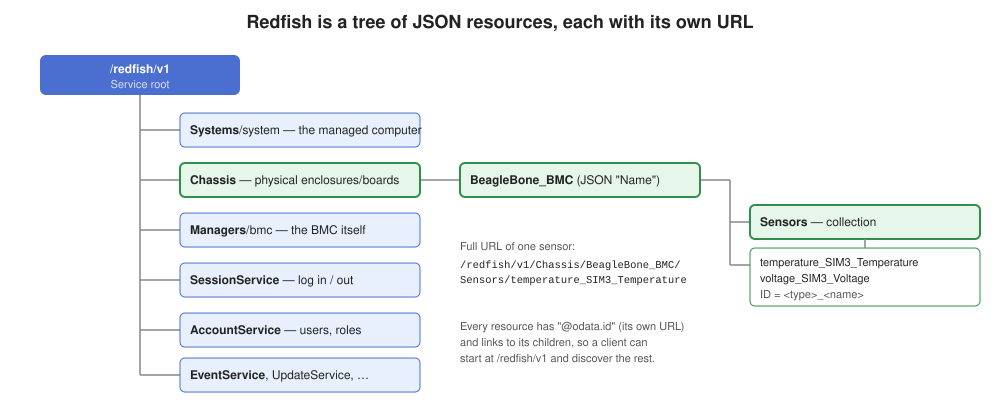
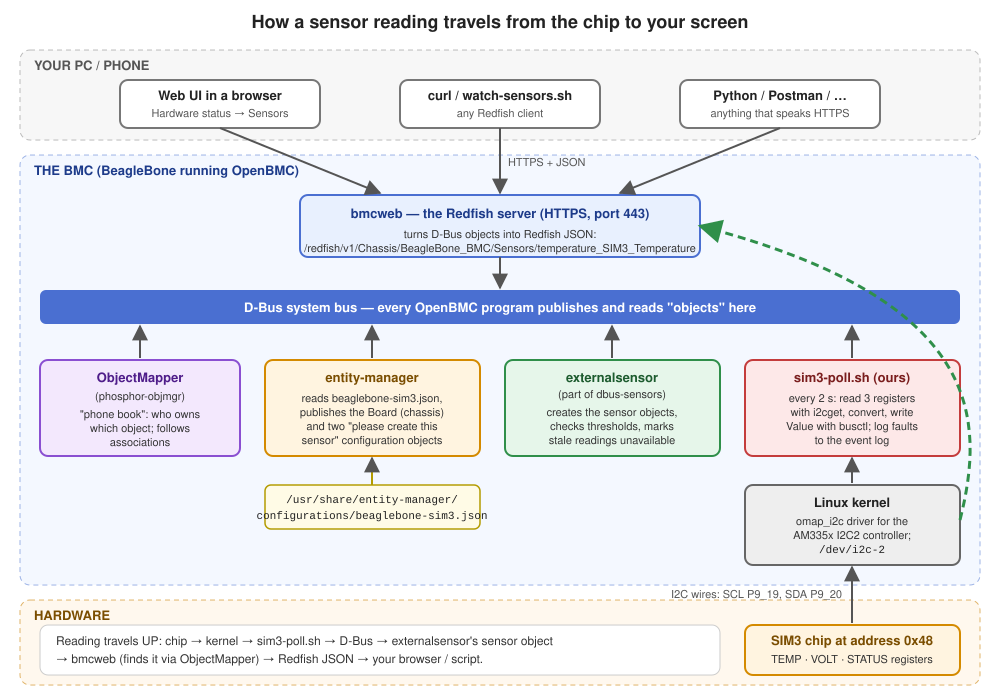
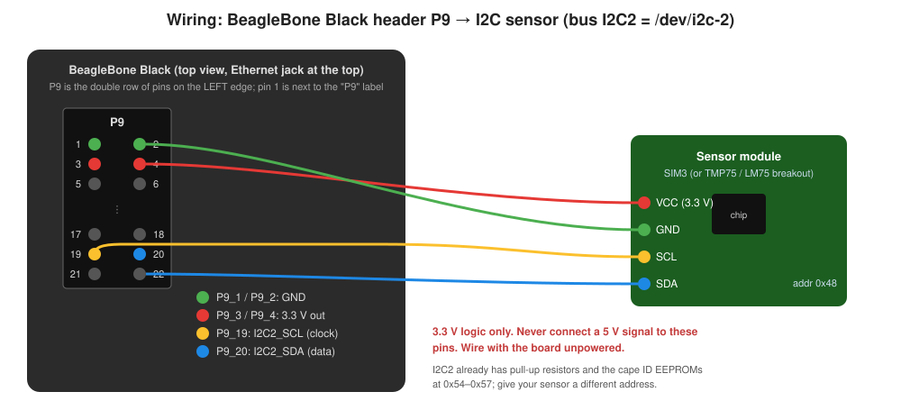
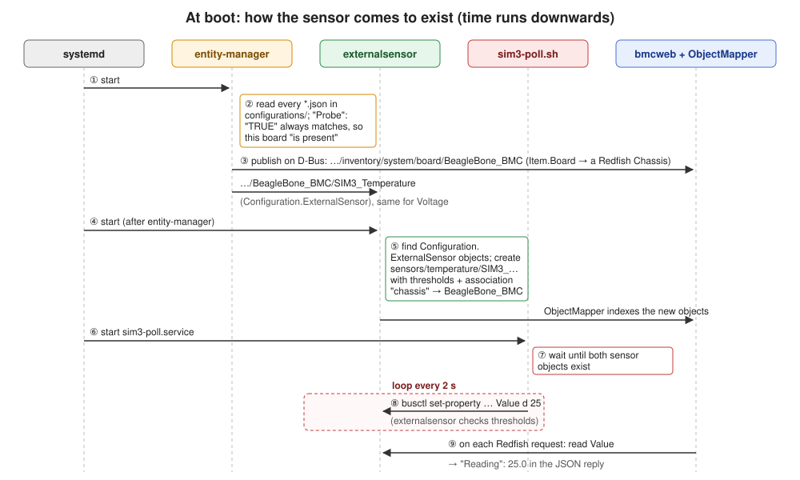
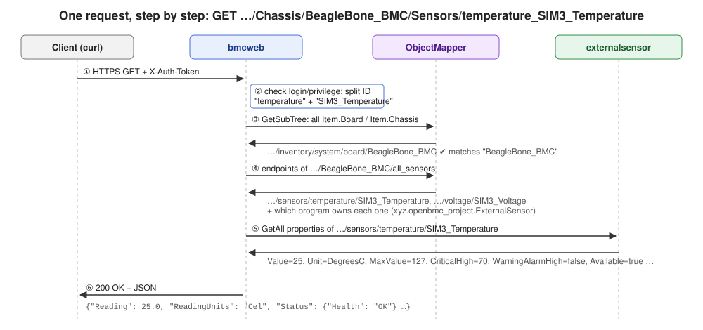

# Redfish and I2C sensors on the BeagleBone BMC

This guide explains:

1. **What Redfish is** and how OpenBMC implements it.
2. **How to use Redfish** on your BeagleBone: it's already running; here's how to talk to it.
3. **How to add an I2C sensor**: a simple chip with three registers, wired to a
   specific I2C bus, and every piece of software between that chip and your screen.
4. **How to keep watching it**: in the web UI, from a script on your PC, and on
   the BMC itself.

It assumes you've read the [main BeagleBone guide](../README.md) (what Yocto,
layers and recipes are, and how to build and flash the image).

| In this folder | What it is |
| --- | --- |
| [`README.md`](README.md) | This guide |
| [`images/`](images/) | Diagrams |
| [`files/meta-evb-beaglebone/`](files/meta-evb-beaglebone/) | Ready-to-copy additions to the BeagleBone layer: the SIM3 sensor recipe, its config, script and service, and a bmcweb setting |
| [`files/alternatives/`](files/alternatives/) | The no-code route for a real off-the-shelf chip (TMP75/LM75) |
| [`files/tools/watch-sensors.sh`](files/tools/watch-sensors.sh) | Watch all sensors from your PC over Redfish |
| [`files/tools/sim3-emulator/`](files/tools/sim3-emulator/) | Arduino sketch that makes a microcontroller act like the SIM3 chip |

> **Status of these examples.** Everything here was checked against the exact
> source versions in this repository: bmcweb `937cbc85`, entity-manager
> `95259687`, dbus-sensors `24c1ceaf`. The sensor config passes
> entity-manager's own schema validator, and BitBake parses the recipe and
> settings without errors. The scripts pass `shellcheck` and were tested
> against fake hardware and a mock Redfish server. The Arduino sketch compiles.
> It has **not** yet been run on a real BeagleBone with a real chip, so treat
> the first run as a test.

---

## Contents

1. [Redfish in five minutes](#1-redfish-in-five-minutes)
2. [How OpenBMC implements Redfish](#2-how-openbmc-implements-redfish)
3. [Using Redfish on your BeagleBone](#3-using-redfish-on-your-beaglebone)
4. [How sensors work in OpenBMC](#4-how-sensors-work-in-openbmc)
5. [I2C basics and the BeagleBone's I2C buses](#5-i2c-basics-and-the-beaglebones-i2c-buses)
6. [The example chip: SIM3](#6-the-example-chip-sim3)
7. [Adding the SIM3 sensor, step by step](#7-adding-the-sim3-sensor-step-by-step)
8. [How it's all wired together](#8-how-its-all-wired-together)
9. [Watching the sensor continuously](#9-watching-the-sensor-continuously)
10. [The other route: an off-the-shelf chip with no code](#10-the-other-route-an-off-the-shelf-chip-with-no-code)
11. [Troubleshooting](#11-troubleshooting)
12. [Going further](#12-going-further)
13. [Reference links](#13-reference-links)

---

## 1. Redfish in five minutes

**Redfish** is a standard way to manage servers over the network, published by
the [DMTF](https://www.dmtf.org/standards/redfish) (Distributed Management
Task Force, an industry standards group). It replaces the older **IPMI**
protocol. Where IPMI sends compact binary messages, Redfish uses ordinary web
technology:

* **HTTPS:** the same encrypted protocol your browser uses, on port 443.
* **REST:** everything is a *resource* with its own URL. You read it with
  `GET`, change it with `PATCH`, create things with `POST`, delete with `DELETE`.
* **JSON:** every answer is a JSON document, plain text that both people and
  programs can read.



### Resources form a tree

Everything starts at the **service root**, `/redfish/v1`. It links to the main
**collections**:

| Collection | What it holds |
| --- | --- |
| `/redfish/v1/Systems` | The computer(s) being managed (CPU, memory, power on/off) |
| `/redfish/v1/Chassis` | Physical things: enclosures, boards, and their **sensors** |
| `/redfish/v1/Managers` | The BMC itself (`/redfish/v1/Managers/bmc`): network, firmware, date/time |
| `/redfish/v1/SessionService` | Logging in and out |
| `/redfish/v1/AccountService` | User accounts and roles |
| `/redfish/v1/EventService` | Getting notified of events |
| `/redfish/v1/UpdateService` | Firmware updates |

A **collection** is a list of links. A **member** is one item in it.
Every resource has an `@odata.id` field (its own URL) and links to its
children, so a client can start at `/redfish/v1` and discover everything else
without knowing the URLs in advance.

A sensor reading on this BMC looks like this (shortened):

```json
{
  "@odata.id": "/redfish/v1/Chassis/BeagleBone_BMC/Sensors/temperature_SIM3_Temperature",
  "@odata.type": "#Sensor.v1_11_1.Sensor",
  "Id": "temperature_SIM3_Temperature",
  "Name": "SIM3 Temperature",
  "Reading": 25.0,
  "ReadingType": "Temperature",
  "ReadingUnits": "Cel",
  "ReadingRangeMin": -128.0,
  "ReadingRangeMax": 127.0,
  "Thresholds": {
    "UpperCaution":  { "Reading": 50.0 },
    "UpperCritical": { "Reading": 70.0 },
    "LowerCaution":  { "Reading": 5.0 }
  },
  "Status": { "Health": "OK", "State": "Enabled" }
}
```

Each field is defined by a **schema** published by the DMTF (here,
[`Sensor`](https://redfish.dmtf.org/schemas/v1/Sensor.json)), so every
Redfish server in the world uses the same names. That's the main advantage
over IPMI: one client works with any vendor's BMC.

### Logging in

Every request except `GET /redfish/v1` needs credentials. Two ways:

1. **Basic authentication:** send user and password with every request
   (`curl -u root:0penBmc …`). Simple, good for trying things out.
2. **Sessions:** `POST` your user and password once to
   `/redfish/v1/SessionService/Sessions`. The reply has an `X-Auth-Token`
   header; send that token with later requests. When done, `DELETE` the
   session's URL (the `Location` header) to log out. Better for scripts that
   make many requests: the password isn't sent each time.

Users have **roles** that limit what they can do: `Administrator` (everything),
`Operator` (operate the system, not manage users), `ReadOnly` (look only).

---

## 2. How OpenBMC implements Redfish

### bmcweb

In OpenBMC, Redfish is served by **[bmcweb](https://github.com/openbmc/bmcweb)**,
a web server written in C++. It is one program that:

* listens for HTTPS on port 443 (also serving the web UI's files),
* checks logins (against the BMC's Linux users, through PAM),
* answers every Redfish URL.

bmcweb **keeps almost no data of its own**. For each request it asks the
other OpenBMC programs for the current values over **D-Bus**, and converts the
answers to Redfish JSON on the fly. The code for each part of Redfish lives in
`redfish-core/lib/` in bmcweb's source: `chassis.hpp`, `sensors.hpp`,
`systems.hpp`, and so on.

### D-Bus: how OpenBMC programs talk to each other

**D-Bus** is a message system built into Linux. In OpenBMC, every program
publishes what it knows as **objects** on the system bus:

* An **object path** looks like a file path:
  `/xyz/openbmc_project/sensors/temperature/SIM3_Temperature`.
* An object has **interfaces**, named groups of **properties** (values) and
  **methods** (actions). For example, `xyz.openbmc_project.Sensor.Value` has
  the properties `Value`, `Unit`, `MaxValue` and `MinValue`.
* Each object is owned by a **service** (the program), for example
  `xyz.openbmc_project.ExternalSensor`.

All OpenBMC interfaces are defined in
[phosphor-dbus-interfaces](https://github.com/openbmc/phosphor-dbus-interfaces).
That shared definition is what lets programs written by different people work
together.

You can look at D-Bus yourself on the BMC with `busctl`:

```sh
busctl tree xyz.openbmc_project.ExternalSensor          # objects of one service
busctl introspect xyz.openbmc_project.ExternalSensor \
    /xyz/openbmc_project/sensors/temperature/SIM3_Temperature   # interfaces and properties
busctl get-property xyz.openbmc_project.ExternalSensor \
    /xyz/openbmc_project/sensors/temperature/SIM3_Temperature \
    xyz.openbmc_project.Sensor.Value Value                       # one property
```

### The ObjectMapper and associations

bmcweb has to find things without knowing which program owns them. The
**ObjectMapper** ([phosphor-objmgr](https://github.com/openbmc/phosphor-objmgr),
service `xyz.openbmc_project.ObjectMapper`) is a "phone book". It watches the
bus and can answer questions like "which objects implement interface X, and who
owns them?" (`GetSubTree`).

**Associations** link objects. A sensor object carries the interface
`xyz.openbmc_project.Association.Definitions` with an entry like
`("chassis", "all_sensors", "/xyz/openbmc_project/inventory/system/board/BeagleBone_BMC")`.
The ObjectMapper turns that into a reverse link at
`/xyz/openbmc_project/inventory/system/board/BeagleBone_BMC/all_sensors`,
which lists every sensor belonging to that board. **That association is how a
sensor ends up under a particular chassis in Redfish.** No association means
the sensor exists on D-Bus but never appears in Redfish.



---

## 3. Using Redfish on your BeagleBone

### It's already running

There's nothing to launch: bmcweb is part of the image and starts at boot.
systemd starts it on demand through a **socket unit**: `bmcweb.socket`
listens on port 443, and the first connection starts `bmcweb.service`. To check
on the BMC (serial console or SSH):

```sh
systemctl status bmcweb.socket bmcweb.service
journalctl -u bmcweb -f            # bmcweb's log, live (Ctrl+C to stop)
systemctl restart bmcweb           # restart it if you ever need to
```

### First requests with curl

From your PC (Linux/macOS terminal, or Windows PowerShell with `curl.exe`).
`-k` accepts the BMC's self-signed certificate; replace `<bmc-ip>` with the
board's address.

```sh
# Service root: works without logging in
curl -k https://<bmc-ip>/redfish/v1

# With user and password (basic authentication)
curl -k -u root:0penBmc https://<bmc-ip>/redfish/v1/Managers/bmc
curl -k -u root:0penBmc https://<bmc-ip>/redfish/v1/Chassis
```

Install [`jq`](https://jqlang.github.io/jq/) (`sudo apt-get install jq`) to
pretty-print and pick out fields:

```sh
curl -sk -u root:0penBmc https://<bmc-ip>/redfish/v1/Managers/bmc | jq '.FirmwareVersion, .Status'
```

### With a session token

```sh
# Log in: print the response headers (-D -), keep only the token
TOKEN=$(curl -sk -D - -o /dev/null -H "Content-Type: application/json" \
  -X POST https://<bmc-ip>/redfish/v1/SessionService/Sessions \
  -d '{"UserName":"root","Password":"0penBmc"}' | awk 'tolower($1)=="x-auth-token:" {print $2}' | tr -d '\r')

# Use it
curl -sk -H "X-Auth-Token: $TOKEN" https://<bmc-ip>/redfish/v1/Chassis | jq
```

### Change the default password (do this first)

`PATCH` changes properties of a resource:

```sh
curl -k -u root:0penBmc -X PATCH -H "Content-Type: application/json" \
  https://<bmc-ip>/redfish/v1/AccountService/Accounts/root \
  -d '{"Password": "a-new-strong-password"}'
```

### In a browser

* `https://<bmc-ip>/` is the **web UI** ([webui-vue](https://github.com/openbmc/webui-vue)).
  It's a JavaScript app that itself talks Redfish to bmcweb. Sensors are under
  **Hardware status → Sensors**.
* `https://<bmc-ip>/redfish/v1` in a browser shows raw JSON (Firefox formats it
  nicely).

### Useful URLs on this BMC

| URL | What you get |
| --- | --- |
| `/redfish/v1` | Service root |
| `/redfish/v1/Managers/bmc` | BMC info: firmware version, status |
| `/redfish/v1/Managers/bmc/EthernetInterfaces` | Network settings |
| `/redfish/v1/Chassis` | List of chassis (after the steps below: `BeagleBone_BMC`) |
| `/redfish/v1/Chassis/BeagleBone_BMC/Sensors` | All sensors of that chassis |
| `/redfish/v1/Chassis/BeagleBone_BMC/Sensors/temperature_SIM3_Temperature` | One sensor |
| `/redfish/v1/Systems/system/LogServices/EventLog/Entries` | Event log (needs the bmcweb setting in step 7.4) |
| `/redfish/v1/Managers/bmc/LogServices/Journal/Entries` | BMC's system journal |
| `/redfish/v1/AccountService/Accounts` | Users |

Two things that are **off** in this build: the `$expand` query parameter
(fetch a collection and its members in one request) and the older
`Chassis/<id>/Thermal` and `Power` resources. Use `/Sensors` instead.

### From Python

```python
import requests, urllib3
urllib3.disable_warnings()             # self-signed certificate
bmc = "https://192.168.1.50"
s = requests.Session(); s.verify = False
s.auth = ("root", "0penBmc")
for m in s.get(f"{bmc}/redfish/v1/Chassis/BeagleBone_BMC/Sensors").json()["Members"]:
    r = s.get(bmc + m["@odata.id"]).json()
    print(r["Name"], r["Reading"], r["ReadingUnits"], r["Status"]["Health"])
```

---

## 4. How sensors work in OpenBMC

### What a sensor is, to OpenBMC

A sensor is a **D-Bus object** under `/xyz/openbmc_project/sensors/<type>/<name>`,
where `<type>` is `temperature`, `voltage`, `current`, `power`, `fan_tach`,
`humidity` and so on. It has these interfaces:

| Interface | Properties | Meaning |
| --- | --- | --- |
| `xyz.openbmc_project.Sensor.Value` | `Value`, `Unit`, `MaxValue`, `MinValue` | The reading |
| `xyz.openbmc_project.Sensor.Threshold.Warning` | `WarningHigh`, `WarningLow`, `WarningAlarmHigh`, `WarningAlarmLow` | Warning limits, and whether they're crossed |
| `xyz.openbmc_project.Sensor.Threshold.Critical` | `CriticalHigh`, `CriticalLow`, `CriticalAlarmHigh`, `CriticalAlarmLow` | Critical limits, same |
| `xyz.openbmc_project.State.Decorator.Availability` | `Available` | Can it be read right now? |
| `xyz.openbmc_project.State.Decorator.OperationalStatus` | `Functional` | Is it working? |
| `xyz.openbmc_project.Association.Definitions` | `Associations` | Which chassis it belongs to |

bmcweb maps these to Redfish: `Value` → `Reading`, thresholds → `Thresholds`,
alarms → `Status.Health` (`OK`, `Warning`, `Critical`).

### Who creates sensors: two generations

OpenBMC has two ways to create sensors:

| | Older: **phosphor-hwmon** + phosphor-inventory-manager | Modern: **entity-manager** + **dbus-sensors** |
| --- | --- | --- |
| Configuration | One config file per hwmon device, fixed at build time | JSON files describing boards; detected at run time |
| Where a sensor comes from | A Linux hwmon driver | A hwmon driver, *or* an external program, ADC, PSU, NVMe… |
| Chassis association | Must be configured separately | Automatic, from the JSON |
| Used by | Older machines | Most current machines |

**This image currently uses the older stack** (OpenBMC's default). This guide
switches it to **entity-manager + dbus-sensors** (step 7.1), because sensors
then appear in Redfish automatically and custom chips are easy to add.

### entity-manager

[entity-manager](https://github.com/openbmc/entity-manager) reads JSON
**configuration files** describing hardware: one file per board or card. It
looks in two folders:

* `/usr/share/entity-manager/configurations/` (installed by recipes),
* `/etc/entity-manager/configurations/` (your own additions on a running BMC).

Each file has:

* **`Name`** and **`Type`** (`Board`, `Chassis`, …): the hardware item.
  It's published at `/xyz/openbmc_project/inventory/system/<type>/<Name>`
  (spaces become `_`), with an `xyz.openbmc_project.Inventory.Item.Board`
  interface. bmcweb lists every `Item.Board`/`Item.Chassis` object as a
  Redfish **Chassis**.
* **`Probe`**: when this hardware is present. Usually "when an EEPROM with
  these contents is found"; `"TRUE"` means "always" (right for hardware
  that's always fitted, like our sensor).
* **`Exposes`**: a list of features: sensors, fans, and so on. Each becomes a
  D-Bus object with an interface `xyz.openbmc_project.Configuration.<Type>`
  (for example `Configuration.ExternalSensor`). These are **requests**: "a
  sensor like this should exist".

### dbus-sensors

[dbus-sensors](https://github.com/openbmc/dbus-sensors) is a set of small
programs ("reactors"), one per kind of sensor. Each watches for the
`Configuration.<Type>` objects it understands and creates the real sensor
objects:

| Program | Handles `Type` | Reads from |
| --- | --- | --- |
| `hwmontempsensor` | `TMP75`, `LM75A`, `TMP112`, `EMC1413`, … | Linux hwmon files (`/sys/class/hwmon/…`) |
| `adcsensor` | `ADC` | The chip's ADC pins |
| `fansensor` | `AspeedFan`, `I2CFan`, … | Fan tachometers |
| `psusensor` | `pmbus`, many PSU models | PMBus power supplies |
| `externalsensor` | `ExternalSensor` | **Nothing**: another program writes the value |

All of them also check thresholds, set alarms, and add the chassis association.

---

## 5. I2C basics and the BeagleBone's I2C buses

**I2C** (say "I-squared-C") is a simple two-wire bus for chips on a board:

* **SCL** (clock) and **SDA** (data), plus ground. Both lines need
  **pull-up resistors** to the supply voltage.
* One **controller** (the BeagleBone) talks to many **targets** (sensors,
  EEPROMs…). Each target has a 7-bit **address** (for example `0x48`), set by
  the chip's design and sometimes by its address pins.
* Most sensors have **registers**: small numbered memory slots. To read one,
  the controller writes the register number, then reads the value back.

The BeagleBone Black's processor has three I2C controllers:

| Controller | Linux device | Where | Use |
| --- | --- | --- | --- |
| I2C0 | `/dev/i2c-0` | On the board only | Power-management chip, board ID EEPROM, HDMI. **Don't use.** |
| I2C1 | `/dev/i2c-1` (if enabled) | P9_17/P9_18 | **Off** by default; needs a device tree change |
| I2C2 | `/dev/i2c-2` | **P9_19 (SCL), P9_20 (SDA)** | Enabled, 100 kHz, has pull-ups. Used for cape ID EEPROMs at `0x54`–`0x57`. **Use this one.** |



### Wire it

With the board **powered off**:

| Sensor pin | BeagleBone pin |
| --- | --- |
| VCC | P9_3 (3.3 V) |
| GND | P9_1 (GND) |
| SCL | P9_19 (I2C2_SCL) |
| SDA | P9_20 (I2C2_SDA) |

⚠ The BeagleBone's pins are **3.3 V only**. A 5 V signal can destroy the processor.

### Talk to it by hand with i2c-tools

The image includes `i2c-tools`. On the BMC:

```sh
i2cdetect -l              # list buses: i2c-0, i2c-2 ...
i2cdetect -y -r 2         # scan bus 2: prints a grid; your chip's address shows as "48"
                          # (54-57 show as "UU" or numbers: those are the cape EEPROMs)
i2cget -y 2 0x48 0x00 b   # read register 0x00 of chip 0x48 on bus 2 as one byte
i2cset -y 2 0x48 0x03 0x01 b   # write 0x01 to register 0x03 (only if your chip has one!)
```

If `i2cdetect` doesn't show your chip, the software steps below can't work
either: check wiring, power and address first.

---

## 6. The example chip: SIM3

To keep the example concrete, this guide uses a made-up but realistic chip
called **SIM3** ("simple, 3 registers") at address **0x48**:

| Register | Name | Format | Example |
| --- | --- | --- | --- |
| `0x00` | TEMP | Signed 8-bit, 1 °C per step | `0x19` = 25 °C, `0xF6` = −10 °C |
| `0x01` | VOLT | Unsigned 8-bit, 20 mV per step | `0xA5` = 165 × 20 mV = 3.300 V |
| `0x02` | STATUS | Bit flags | bit 0 = data ready, bit 1 = alert, bit 7 = fault |

Real chips look much like this. Replace the register numbers and conversion
formulas with the ones from your chip's datasheet.

**No SIM3 chip?** You have three options:
1. **Simulation mode:** the script makes up readings (`SIM3_SIMULATE=1`, step 7.7).
   Everything except the I2C wires gets tested.
2. **A microcontroller pretending to be SIM3:** flash
   [`files/tools/sim3-emulator/sim3-emulator.ino`](files/tools/sim3-emulator/sim3-emulator.ino)
   to a **3.3 V** board (Raspberry Pi Pico, Arduino Pro Mini 3.3 V, ESP32…)
   and wire it like the sensor. Its serial monitor lets you make it "hot" or
   raise the fault bit, to test alarms.
3. **A real temperature chip** such as a TMP75 or LM75 breakout board (about
   $2–5): see [section 10](#10-the-other-route-an-off-the-shelf-chip-with-no-code).

### Why not a kernel driver?

For a custom chip, the "textbook" route is a Linux **hwmon driver** (C code in
the kernel), plus a device tree entry, plus a new device type in dbus-sensors.
That's three projects to change. Instead, we use dbus-sensors'
**ExternalSensor**: entity-manager and `externalsensor` create a normal sensor
(thresholds, Redfish and all), and a **20-line loop in a shell script** reads
the chip and writes the value in. It's the quickest way to get a custom chip
into Redfish, and easy to understand and change. [Section 12](#12-going-further)
covers the heavier routes.

---

## 7. Adding the SIM3 sensor, step by step

Overview of the changes (all files are in [`files/`](files/)):

```
meta-evb/meta-evb-beaglebone/
├── conf/machine/evb-beaglebone.conf          ← 7.1  switch to entity-manager + dbus-sensors
└── recipes-phosphor/
    ├── sim3/
    │   ├── sim3-sensor_1.0.bb                ← 7.3  the recipe
    │   └── sim3-sensor/
    │       ├── beaglebone-sim3.json          ← 7.2  entity-manager config
    │       ├── sim3-poll.sh                  ← 7.3  reads the chip, writes D-Bus
    │       └── sim3-poll.service             ← 7.3  starts the script at boot
    └── interfaces/
        └── bmcweb_%.bbappend                 ← 7.4  show the event log in Redfish
```

### 7.1 Switch to the modern sensor stack

Add these lines to the end of
`meta-evb/meta-evb-beaglebone/conf/machine/evb-beaglebone.conf`:

```bitbake
# Use entity-manager (hardware description from JSON) and dbus-sensors
# (sensor programs) instead of phosphor-inventory-manager and phosphor-hwmon.
VIRTUAL-RUNTIME_obmc-inventory-manager = "entity-manager"
VIRTUAL-RUNTIME_obmc-sensors-hwmon = "dbus-sensors"
```

`VIRTUAL-RUNTIME_…` variables name which package fills a "slot" in OpenBMC's
package groups. The `obmc-inventory` and `obmc-sensors` image features install
whatever these name. (Checked with `bitbake -e`: the package groups then pull in
`entity-manager` and `dbus-sensors`.)

### 7.2 Describe the hardware: `beaglebone-sim3.json`

[`files/.../beaglebone-sim3.json`](files/meta-evb-beaglebone/recipes-phosphor/sim3/sim3-sensor/beaglebone-sim3.json):

```json
{
    "Name": "BeagleBone BMC",
    "Type": "Board",
    "Probe": "TRUE",
    "xyz.openbmc_project.Inventory.Decorator.Asset": {
        "Manufacturer": "BeagleBoard.org", "Model": "BeagleBone Black", ...
    },
    "Exposes": [
        {
            "Name": "SIM3 Temperature",
            "Type": "ExternalSensor",
            "Units": "DegreesC",
            "MinValue": -128, "MaxValue": 127,
            "Timeout": 10,
            "Thresholds": [
                { "Name": "upper critical",     "Direction": "greater than", "Severity": 1, "Value": 70 },
                { "Name": "upper non critical", "Direction": "greater than", "Severity": 0, "Value": 50 },
                { "Name": "lower non critical", "Direction": "less than",    "Severity": 0, "Value": 5 }
            ]
        },
        {
            "Name": "SIM3 Voltage",
            "Type": "ExternalSensor",
            "Units": "Volts",
            "MinValue": 0, "MaxValue": 5.1,
            "Timeout": 10,
            "Thresholds": [ ... 3.0 V low critical, 3.6 V high critical ... ]
        }
    ]
}
```

Field by field:

| Field | Meaning |
| --- | --- |
| `Name: "BeagleBone BMC"` | The board. Becomes `/xyz/openbmc_project/inventory/system/board/BeagleBone_BMC` and Redfish chassis **`BeagleBone_BMC`** |
| `Type: "Board"` | Gives it the `Inventory.Item.Board` interface, which bmcweb shows as a Chassis |
| `Probe: "TRUE"` | Always present |
| `Inventory.Decorator.Asset` | Shows up as Manufacturer/Model/PartNumber/SerialNumber in Redfish |
| `Exposes[].Type: "ExternalSensor"` | Handled by dbus-sensors' `externalsensor` |
| `Units` | `DegreesC`, `Volts`, `Amperes`, `Watts`, `RPMS`, `Percent`, … Decides the D-Bus path (`temperature/`, `voltage/`) and the Redfish units |
| `MinValue` / `MaxValue` | The sensor's possible range (required) |
| `Timeout: 10` | If no new value is written for 10 s, the reading becomes "not available" (shown as `null` in Redfish) instead of a stale number |
| `Thresholds` | `Severity` 0 = warning (Redfish "Caution"), 1 = critical. `Direction` says which side is bad |

Check a JSON file against entity-manager's schemas before using it:
```sh
git clone https://github.com/openbmc/entity-manager && cd entity-manager
pip install jsonschema referencing
python3 scripts/validate_configs.py -v -c /path/to/beaglebone-sim3.json
```

### 7.3 The reader script, service and recipe

**[`sim3-poll.sh`](files/meta-evb-beaglebone/recipes-phosphor/sim3/sim3-sensor/sim3-poll.sh)**
(every line is commented in the file). In short:

1. Wait until `externalsensor` has created
   `/xyz/openbmc_project/sensors/temperature/SIM3_Temperature` and
   `/xyz/openbmc_project/sensors/voltage/SIM3_Voltage`.
2. Every 2 seconds:
   * read STATUS, TEMP and VOLT with `i2cget -y 2 0x48 <reg> b`;
   * if the chip doesn't answer, or STATUS says *fault* or *not ready*, write
     nothing (the 10 s timeout then marks the readings unavailable) and add
     an entry to the BMC event log, once per change;
   * otherwise convert (signed byte → °C; byte × 20 mV → volts) and write:
     ```sh
     busctl set-property xyz.openbmc_project.ExternalSensor \
         /xyz/openbmc_project/sensors/temperature/SIM3_Temperature \
         xyz.openbmc_project.Sensor.Value Value d 25
     ```
   * if STATUS has the *alert* bit, add a warning to the event log.

Settings (bus, address, interval, simulation) can be changed without rebuilding
by creating `/etc/default/sim3-poll` on the BMC:

```sh
SIM3_BUS=2
SIM3_ADDR=0x48
SIM3_INTERVAL=2
SIM3_SIMULATE=0
```

**[`sim3-poll.service`](files/meta-evb-beaglebone/recipes-phosphor/sim3/sim3-sensor/sim3-poll.service)**
is a systemd unit. It starts the script after `externalsensor` and
`entity-manager`, reads `/etc/default/sim3-poll`, and restarts the script if it
ever exits.

**[`sim3-sensor_1.0.bb`](files/meta-evb-beaglebone/recipes-phosphor/sim3/sim3-sensor_1.0.bb)**
is the Yocto recipe that installs them:

| File | Installed to |
| --- | --- |
| `beaglebone-sim3.json` | `/usr/share/entity-manager/configurations/` |
| `sim3-poll.sh` | `/usr/libexec/sim3-sensor/` |
| `sim3-poll.service` | `/usr/lib/systemd/system/` (and enabled) |

It declares run-time dependencies on `bash`, `i2c-tools`, `entity-manager`,
`dbus-sensors` and `systemd`.

Copy the recipe folder into the layer:

```sh
cd openbmc
cp -r beaglebone/redfish-i2c-sensor/files/meta-evb-beaglebone/recipes-phosphor \
      meta-evb/meta-evb-beaglebone/
```

### 7.4 Show the event log in Redfish (optional but recommended)

[`bmcweb_%.bbappend`](files/meta-evb-beaglebone/recipes-phosphor/interfaces/bmcweb_%25.bbappend)
(copied with the folder above) adds bmcweb's `redfish-dbus-log` option. That
makes the BMC's event log, including the entries `sim3-poll.sh` creates,
visible at `/redfish/v1/Systems/system/LogServices/EventLog/Entries` and on
the web UI's **Logs → Event logs** page. A `.bbappend` named `bmcweb_%`
applies to any bmcweb version (`%` is a wildcard).

### 7.5 Add the package to the image

Add to the machine file (or your `conf/local.conf`):

```bitbake
IMAGE_INSTALL:append = " sim3-sensor"
```

(The leading space matters: `:append` adds text exactly as written.)

### 7.6 Build, flash, boot

Commit your changes and run the GitHub workflow, or build locally:

```sh
./beaglebone/build-beaglebone.sh
```

Only the changed and new recipes are rebuilt (entity-manager, dbus-sensors,
bmcweb, sim3-sensor and the image), so this is much faster than the first
build. Flash and boot as in the [main guide](../README.md#9-flash-and-boot).

### 7.7 Check every link in the chain

On the BMC (SSH or serial console), from the bottom up:

```sh
# 1. The chip answers on the bus
i2cdetect -y -r 2
i2cget -y 2 0x48 0x00 b            # e.g. 0x19 = 25 °C

# 2. entity-manager loaded the JSON and published the board + sensor configs
busctl tree xyz.openbmc_project.EntityManager
#   └─/xyz/openbmc_project/inventory/system/board/BeagleBone_BMC
#     ├─…/BeagleBone_BMC/SIM3_Temperature
#     └─…/BeagleBone_BMC/SIM3_Voltage

# 3. externalsensor created the sensors
busctl tree xyz.openbmc_project.ExternalSensor
busctl introspect xyz.openbmc_project.ExternalSensor \
    /xyz/openbmc_project/sensors/temperature/SIM3_Temperature

# 4. The script is running and writing values
systemctl status sim3-poll
journalctl -u sim3-poll -f
busctl get-property xyz.openbmc_project.ExternalSensor \
    /xyz/openbmc_project/sensors/temperature/SIM3_Temperature \
    xyz.openbmc_project.Sensor.Value Value        # d 25

# 5. The association exists (this is what puts it under the chassis)
busctl get-property xyz.openbmc_project.ObjectMapper \
    /xyz/openbmc_project/inventory/system/board/BeagleBone_BMC/all_sensors \
    xyz.openbmc_project.Association Endpoints
```

From your PC:

```sh
curl -sk -u root:0penBmc https://<bmc-ip>/redfish/v1/Chassis | jq '.Members'
curl -sk -u root:0penBmc https://<bmc-ip>/redfish/v1/Chassis/BeagleBone_BMC/Sensors | jq '.Members'
curl -sk -u root:0penBmc \
  https://<bmc-ip>/redfish/v1/Chassis/BeagleBone_BMC/Sensors/temperature_SIM3_Temperature | jq
```

And in the web UI: **Hardware status → Sensors**.

**No chip yet?** Turn on simulation mode:

```sh
echo SIM3_SIMULATE=1 > /etc/default/sim3-poll
systemctl restart sim3-poll
```

### 7.8 Experiment without rebuilding

The BeagleBone's root filesystem is writable, so you can try changes directly
on the board:

* **Change thresholds or names:** copy the JSON to
  `/etc/entity-manager/configurations/`, edit it there, and delete the copy in
  `/usr/share/…` (two files with the same board would make two boards). Then:
  ```sh
  systemctl restart xyz.openbmc_project.EntityManager
  ```
* **Change the script:** edit `/usr/libexec/sim3-sensor/sim3-poll.sh`, then
  `systemctl restart sim3-poll`.
* **Set a value by hand** (stop the script first, or it overwrites you):
  ```sh
  systemctl stop sim3-poll
  busctl set-property xyz.openbmc_project.ExternalSensor \
      /xyz/openbmc_project/sensors/temperature/SIM3_Temperature \
      xyz.openbmc_project.Sensor.Value Value d 75     # above 70 → Critical in Redfish
  ```

Once happy, copy your changes back into the layer so the next build has them.

---

## 8. How it's all wired together

### At boot



1. systemd starts **entity-manager**. It reads every JSON file. `Probe: TRUE`
   matches, so it publishes the board at
   `/xyz/openbmc_project/inventory/system/board/BeagleBone_BMC`, plus one
   `xyz.openbmc_project.Configuration.ExternalSensor` object per `Exposes` entry
   (`…/BeagleBone_BMC/SIM3_Temperature`, `…/SIM3_Voltage`), holding all the
   JSON fields as D-Bus properties.
2. systemd starts **externalsensor** (its unit says "after entity-manager").
   It asks for every `Configuration.ExternalSensor` object and, for each, creates
   `/xyz/openbmc_project/sensors/<type>/<Name>` with the `Sensor.Value`,
   threshold, availability and association interfaces. The association points
   to the parent of the configuration object, the board.
3. The **ObjectMapper** notices the new objects and indexes them, including the
   `all_sensors` reverse association on the board.
4. systemd starts **sim3-poll**. It waits until the sensor objects exist, then
   writes a value every 2 seconds. On each write, externalsensor compares the
   value with the thresholds and updates the alarm properties.

### When you ask for a reading



1. bmcweb checks your login.
2. It splits the ID `temperature_SIM3_Temperature` into type `temperature`
   and name `SIM3_Temperature`.
3. It asks the ObjectMapper for all `Item.Board`/`Item.Chassis` objects and
   finds `…/board/BeagleBone_BMC`, matching the chassis ID in the URL.
4. It reads the `all_sensors` association of that board to get the sensor list
   and who owns each sensor.
5. It reads all properties of the matching sensor from `externalsensor`.
6. It converts them into Redfish JSON and replies.

Nothing is cached: every request reflects the latest value written by the script.

### Names, from JSON to screen

| Where | Temperature sensor | Board |
| --- | --- | --- |
| JSON `Name` | `SIM3 Temperature` | `BeagleBone BMC` |
| D-Bus object | `/xyz/openbmc_project/sensors/temperature/SIM3_Temperature` | `/xyz/openbmc_project/inventory/system/board/BeagleBone_BMC` |
| Redfish ID | `temperature_SIM3_Temperature` (type + `_` + name) | `BeagleBone_BMC` |
| Redfish URL | `/redfish/v1/Chassis/BeagleBone_BMC/Sensors/temperature_SIM3_Temperature` | `/redfish/v1/Chassis/BeagleBone_BMC` |
| Web UI | "SIM3 Temperature" | — |

Spaces and other special characters become `_`.

### Units and thresholds, from JSON to Redfish

| JSON | D-Bus | Redfish |
| --- | --- | --- |
| `"Units": "DegreesC"` | `Unit = xyz.openbmc_project.Sensor.Value.Unit.DegreesC`, path `temperature/` | `"ReadingUnits": "Cel"`, `"ReadingType": "Temperature"` |
| `"Units": "Volts"` | `Unit = …Unit.Volts`, path `voltage/` | `"ReadingUnits": "V"`, `"ReadingType": "Voltage"` |
| `MinValue` / `MaxValue` | `MinValue` / `MaxValue` | `ReadingRangeMin` / `ReadingRangeMax` |
| Threshold `Severity 0`, `greater than` | `WarningHigh` (+ `WarningAlarmHigh`) | `Thresholds.UpperCaution.Reading` |
| Threshold `Severity 1`, `greater than` | `CriticalHigh` (+ `CriticalAlarmHigh`) | `Thresholds.UpperCritical.Reading` |
| Threshold `Severity 0/1`, `less than` | `WarningLow` / `CriticalLow` | `LowerCaution` / `LowerCritical` |
| Any alarm set | `…AlarmHigh/Low = true` | `"Status": {"Health": "Warning"}` or `"Critical"` |

---

## 9. Watching the sensor continuously

### In the web UI

**Hardware status → Sensors** lists every sensor with its reading, thresholds
and status (OK / Warning / Critical). Use the page's refresh button to update
it, or reload the page.

### From your PC: `watch-sensors.sh`

[`files/tools/watch-sensors.sh`](files/tools/watch-sensors.sh) logs in once
(session token), then every few seconds prints a table of all sensors of a
chassis, and logs out when you press Ctrl+C:

```sh
sudo apt-get install curl jq
./watch-sensors.sh 192.168.1.50                     # chassis BeagleBone_BMC, every 3 s
./watch-sensors.sh 192.168.1.50 BeagleBone_BMC 1    # every second
BMC_PASS='new-password' ./watch-sensors.sh 192.168.1.50
```

```
Sensors of chassis BeagleBone_BMC on 192.168.1.50   (14:02:11, every 3s, Ctrl+C to stop)

SENSOR                                  READING  UNITS      HEALTH    STATE
------                                  -------  -----      ------    -----
SIM3 Temperature                           25.0  Cel        OK        Enabled
SIM3 Voltage                                3.3  V          OK        Enabled
```

A reading of `n/a` means the sensor has no current value: the chip isn't
answering, reports a fault, or the script isn't running.

### A one-line version

```sh
watch -n 2 "curl -sk -u root:0penBmc \
  https://<bmc-ip>/redfish/v1/Chassis/BeagleBone_BMC/Sensors/temperature_SIM3_Temperature \
  | jq '{Reading, Health: .Status.Health}'"
```

### On the BMC itself

```sh
journalctl -u sim3-poll -f          # the script's messages: state changes, faults
busctl monitor xyz.openbmc_project.ExternalSensor   # every property change, live
```

### Alarms and the event log

* **Thresholds**: when the temperature passes 50 °C, `Status.Health` becomes
  `Warning`; past 70 °C, `Critical`. The web UI shows that in colour.
* **Event log**: `sim3-poll.sh` adds an entry when the chip stops answering,
  raises its alert bit, or reports a fault. With the bmcweb setting from 7.4:
  ```sh
  curl -sk -u root:0penBmc \
    https://<bmc-ip>/redfish/v1/Systems/system/LogServices/EventLog/Entries | jq '.Members[] | {Created, Severity, Message}'
  ```
  On the BMC, the same entries are under `/xyz/openbmc_project/logging/entry/`
  (`busctl tree xyz.openbmc_project.Logging`).

### Push instead of poll (advanced)

Redfish also has an **EventService**: a client can subscribe and have the BMC
send events instead of asking repeatedly. bmcweb supports a
Server-Sent-Events stream at `/redfish/v1/EventService/SSE`:

```sh
curl -k -N -u root:0penBmc https://<bmc-ip>/redfish/v1/EventService/SSE
```

Which events are sent depends on bmcweb's build options and on how events are
logged, so this guide relies on polling, which always works. bmcweb's own documentation is in its
[`docs/` folder](https://github.com/openbmc/bmcweb/tree/master/docs)
(`Redfish.md` lists what's supported).

---

## 10. The other route: an off-the-shelf chip with no code

If you use a chip that dbus-sensors already knows, there's no script at all.
The kernel driver reads the chip, and `hwmontempsensor` publishes it. For
example, a **TMP75** or **LM75** temperature sensor (wired the same way, at
`0x48`):

1. **Enable the kernel driver.** The BeagleBone kernel configuration doesn't
   include it (checked in the Yocto kernel-cache's `bsp/beaglebone/beaglebone.cfg`).
   Copy [`files/alternatives/lm75.cfg`](files/alternatives/lm75.cfg) to
   `meta-evb/meta-evb-beaglebone/recipes-kernel/linux/linux-yocto/lm75.cfg`
   and [`files/alternatives/linux-yocto_%.bbappend`](files/alternatives/linux-yocto_%25.bbappend)
   to `meta-evb/meta-evb-beaglebone/recipes-kernel/linux/`.
2. **Do 7.1** (switch to entity-manager + dbus-sensors).
3. **Install [`files/alternatives/beaglebone-tmp75.json`](files/alternatives/beaglebone-tmp75.json)**
   instead of the SIM3 JSON. The key part:
   ```json
   { "Name": "Board Temp", "Type": "TMP75", "Bus": 2, "Address": "0x48", "Thresholds": [ ... ] }
   ```
   (You can install it with a copy of the SIM3 recipe without the script and
   service, or by hand into `/etc/entity-manager/configurations/` on the BMC.)

What happens then: `hwmontempsensor` sees `Type: TMP75` and tells the kernel
"there's a tmp75 at 0x48 on bus 2" (it writes `tmp75 0x48` to
`/sys/bus/i2c/devices/i2c-2/new_device`). The kernel's lm75 driver takes over
and creates `/sys/class/hwmon/hwmonN/temp1_input`. `hwmontempsensor` reads
that file every few seconds and publishes
`/xyz/openbmc_project/sensors/temperature/Board_Temp`. In Redfish it's
`…/Chassis/BeagleBone_BMC/Sensors/temperature_Board_Temp`.

Other `Type` values `hwmontempsensor` understands include `LM75A`, `TMP75`,
`TMP112`, `TMP175`, `TMP421`, `TMP441`, `MAX31725`, `EMC1413`, `JC42`,
`HDC1080` and `SI7020`. The full list is in
`src/hwmon-temp/HwmonTempMain.cpp` in dbus-sensors. Each needs its kernel
driver enabled.

---

## 11. Troubleshooting

| Symptom | Check |
| --- | --- |
| `i2cdetect` doesn't show the chip | Wiring (SCL↔P9_19, SDA↔P9_20), 3.3 V and GND, address. Board powered while wiring? Re-seat and reboot. |
| No `BeagleBone_BMC` in `/redfish/v1/Chassis` | `busctl tree xyz.openbmc_project.EntityManager`. If missing: `journalctl -u xyz.openbmc_project.EntityManager` for JSON errors. Is entity-manager installed at all (step 7.1)? |
| Chassis present, but no sensors | `busctl tree xyz.openbmc_project.ExternalSensor`. If empty: `journalctl -u xyz.openbmc_project.externalsensor` (look for "Units", "MinValue" errors). |
| Sensors present, Reading `null` / `n/a` | The script isn't writing: `systemctl status sim3-poll`, `journalctl -u sim3-poll`. It logs "no answer", "FAULT" or "not ready". |
| Script says "waiting for … to appear" forever | The object path in the script must match the JSON `Name` (spaces → `_`) and `Units` (→ `temperature`/`voltage`). |
| Wrong values | Check the conversion against your datasheet: signed or unsigned, scale per step, byte order for 16-bit registers (`i2cget … w` reads a little-endian word). |
| Event log URL gives 404 | The bmcweb `redfish-dbus-log` option (7.4) isn't in the image. |
| `401 Unauthorized` | Wrong user or password, or the session expired. Log in again. |

---

## 12. Going further

* **A C++ daemon instead of the script.** For faster polling or more complex
  chips, write a small program with
  [sdbusplus](https://github.com/openbmc/sdbusplus) that reads `/dev/i2c-2`
  with `ioctl(I2C_RDWR)` and either writes the ExternalSensor's `Value` or
  hosts its own `Sensor.Value` objects with an association to the board.
* **A kernel hwmon driver.** The "proper" route for a chip you'll ship: a
  driver in `drivers/hwmon/`, a device tree node under `&i2c2`, and a new
  entry in dbus-sensors' `hwmontempsensor` type list (or use phosphor-hwmon).
  See the kernel's [hwmon documentation](https://docs.kernel.org/hwmon/hwmon-kernel-api.html).
* **Fan control.** entity-manager JSON can also describe fans and PID control
  loops ([phosphor-pid-control](https://github.com/openbmc/phosphor-pid-control))
  that use your temperature sensor to drive a PWM fan.
* **Virtual sensors** ([phosphor-virtual-sensor](https://github.com/openbmc/phosphor-virtual-sensor))
  compute new sensors from existing ones, such as averages or power = V × I.

---

## 13. Reference links

* Redfish standard and schemas: <https://www.dmtf.org/standards/redfish>, <https://redfish.dmtf.org/schemas/v1/>
* DMTF Redfish developer hub (tutorials, mockups): <https://redfish.dmtf.org/>
* bmcweb: <https://github.com/openbmc/bmcweb> (docs in `docs/`, Redfish code in `redfish-core/lib/`)
* OpenBMC Redfish usage guide: <https://github.com/openbmc/docs/blob/master/REDFISH-cheatsheet.md>
* D-Bus interfaces: <https://github.com/openbmc/phosphor-dbus-interfaces>
* OpenBMC sensor architecture: <https://github.com/openbmc/docs/blob/master/architecture/sensor-architecture.md>
* entity-manager: <https://github.com/openbmc/entity-manager> (`docs/`, `configurations/`, `schemas/`)
* dbus-sensors: <https://github.com/openbmc/dbus-sensors>
* External sensor design: <https://github.com/openbmc/docs/blob/master/designs/external-sensor.md>
* ObjectMapper: <https://github.com/openbmc/phosphor-objmgr>
* Web UI: <https://github.com/openbmc/webui-vue>
* BeagleBone Black pinout and I2C: <https://docs.beagleboard.org/latest/boards/beaglebone/black/>
* Linux I2C tools: <https://manpages.debian.org/i2cget>, <https://manpages.debian.org/i2cdetect>
* Linux `/dev/i2c-N` interface: <https://docs.kernel.org/i2c/dev-interface.html>
